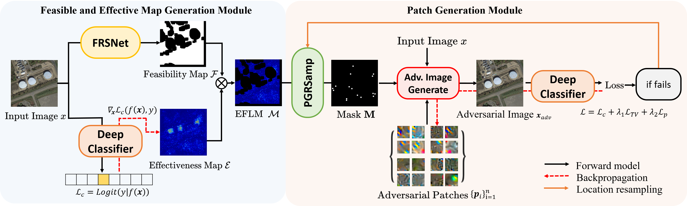

# DeMPAA: Deployable Multi-Patch Adversarial Attack for Remote Sensing Image Classification
Jun-Jie Huang#(jjhuang@nudt.edu.cn), Ziyue Wang#, Tianrui Liu*, Wenhan Luo, Zihan Chen, Wentao Zhao*, and Meng Wang

IEEE Transactions on Geoscience and Remote Sensing 2024.
(#equal contribution, *corresponding author)


## Overview

- We propose a novel Deployable Multi-Mini-Patch Adversarial Attack (DeMPAA) method for RSI classification. Instead of using a single large adversarial patch, 
we propose to search and optimize multiple small adversarial patches for robust and deployable adversarial attack.
    
- In the proposed DeMPAA method, a Feasible and Effective Map Generation (FEMG) module determines a patch location map considering both the feasibility and the effectiveness,
and a Patch Generation (PG) module then samples n key patch locations and optimizes the adversarial patches with respect to adversarial classification loss and imperceptible loss.
    
- From extensive experimental results, the proposed DeMPAA method achieves a significantly higher attacking success rate when compared to other methods, and an imperceptible version of the proposed method i.e.,
DeMPAA-IP generates even more visually imperceptible adversarial patches to be practically feasible for attacking RSI scenes.




### Requisites

- PyTorch>=1.0
- Python>=3.7
- NVIDIA GPU + CUDA CuDNN

### Dataset

We use the Aerial Image Dataset ([AID](http://hyper.ai/datasets/5446)) and the Remote Sensing Image classification dataset created by Northwestern Polytechnical University ([NWPU-RESISC](https://hyper.ai/datasets/5449)) to 
evaluate the proposed method. Both the datasets are publicly available.

### Key parameters
```--patch_size```: The total patch size. E.g. 0.01 ~= 1% of image.

```--patch_number```: The number of patches.

```--netClassifier```: The target classifier: resnet50/resnet34/resnet101/densenet121.

```--save_path```: The path to save the result.

```--data_path```: The data path.

```--train_size```: Number of training images.

```--test_size```: Number of test images.

```--max_count```: The max number of iterations to find adversarial example.

```--image_size```: The height / width of the input image to network.


### Run DeMPAA
We provide two versions of DeMPAA, i.e. DeMPAA and DeMPAA-IP, DeMPAA-IP is the more imperceptible version of DeMPAA.
- To Run *DeMPAA*:

```
python train_DeMPAA.py
```

- To Run *DeMPAA-IP*:

```
python train_DeMPAA_IP.py
```

### Result images
The visualization results of different adversarial patch attack methods on AID.


### Citation
```
@article{huang2024DeMPAA,
  title={DeMPAA: Deployable Multi-Mini-Patch Adversarial Attack for Remote Sensing Image Classification},
  author={Huang, Jun-Jie and Wang, Ziyue and Liu, Tianrui and Luo, Wenhan and Chen, Zihan and Zhao, Wentao and Wang, Meng},
  journal={IEEE Transactions on Geoscience and Remote Sensing},
  year={2024},
  volume={62},
  pages={1-13},
  publisher={IEEE}
}

```
